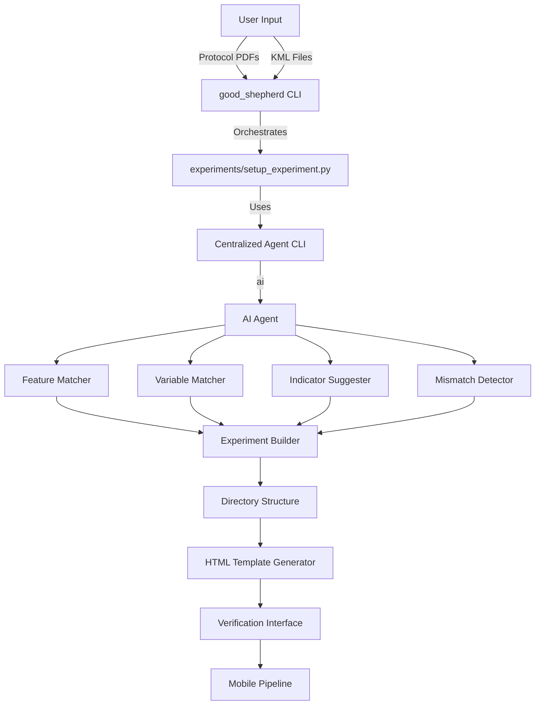

# Experiment Protocol Setup System - Phase 1

## Overview

This system automates the setup of ecological experiments by analyzing protocol documents and KML maps, matching features, identifying required variables, requesting datasheet images, and suggesting indicators. The output is a structured directory that feeds into a mobile field data collection pipeline.

**This plan document should be placed in:** `docs/design/phase1_setup_experiment.md`

## Architecture



## Directory Structure

```
good-shepherd/                      # Root directory
├── good_shepherd                   # Main orchestration script (executable)
├── experiments/                    # Experiments directory
│   ├── _index.json                # Master index of all experiments
│   ├── prompts/                   # Centralized prompts (shared across experiments)
│   │   ├── feature_matching.md
│   │   ├── variable_matching.md
│   │   ├── indicator_suggestion.md
│   │   ├── mismatch_detection.md
│   │   └── json_only_system.md    # System prompt for JSON-only output
│   ├── schemas/                   # Centralized data schemas (shared)
│   │   ├── experiment_schema.json
│   │   ├── feature_schema.json
│   │   ├── variable_schema.json
│   │   └── indicator_schema.json
│   ├── tools/                     # Centralized scripts/tools
│   │   ├── setup_experiment.py   # Main setup script
│   │   ├── agent_invoker.py      # Centralized agent CLI wrapper
│   │   ├── kml_parser.py          # KML parsing utilities
│   │   ├── protocol_parser.py     # Protocol PDF parsing
│   │   ├── html_generator.py     # HTML template generator
│   │   └── status_manager.py      # Status tracking utilities
│   └── {experiment_id}/           # e.g., "bkm_cestrum_2024"
│       ├── experiment.json        # Experiment metadata with status tracking
│       ├── protocol/              # Protocol documents (copied)
│       │   ├── field_protocol_bkm.pdf
│       │   └── ...other_protocols.pdf
│       ├── maps/                  # Map files (copied)
│       │   ├── sites.kml
│       │   ├── sites.geojson      # Converted from KML
│       │   └── ...other_maps.kml
│       ├── features/              # Feature definitions
│       │   ├── features.json      # All features with metadata
│       │   └── feature_hierarchy.json
│       ├── variables/             # Variable definitions
│       │   ├── variables.json     # All variables by feature type
│       │   └── datasheets/        # Datasheet images (user manually places here in Phase 1)
│       │       ├── plot_dbh_template.jpg
│       │       └── ...
│       ├── indicators/            # Indicator definitions
│       │   └── indicators.json    # All indicators by feature type (English descriptions)
│       ├── analysis/               # Analysis outputs
│       │   ├── protocol_analysis.md
│       │   └── mismatches.json
│       ├── verification.html      # Interactive verification interface
│       └── README.md
└── docs/
    └── design/
        └── phase1_setup_experiment.md  # This plan document
```

## Command Sequence

### Main Orchestration Command (Root Level)

```bash
./good_shepherd setup-experiment \
  --name "bkm_cestrum_2024" \
  --protocol "experiments/keystone/bkm/field_protocol_bkm.pdf" \
  --maps "experiments/keystone/bkm/sites/assets/sites.kml" \
  [--stage {initialize|features|variables|indicators|mismatches|html}]
```

**What it does:**

- Invokes `experiments/tools/setup_experiment.py` with proper paths
- Passes through all arguments
- Understands root-relative paths

### Direct Script Invocation (For Testing)

```bash
cd experiments
python tools/setup_experiment.py \
  --name "bkm_cestrum_2024" \
  --protocol "../keystone/bkm/field_protocol_bkm.pdf" \
  --maps "../keystone/bkm/sites/assets/sites.kml" \
  --stage features
```

### Stage-Based Testing

Each stage can be tested independently:

```bash
# Stage 1: Initialize directory structure
./good_shepherd setup-experiment --name "test" --protocol "path/to/protocol.pdf" --maps "path/to/maps.kml" --stage initialize

# Verify: Check that experiment directory exists, JSON files initialized
# Expected: experiments/test/experiment.json with status.stage = "initialized"

# Stage 2: Feature matching
./good_shepherd setup-experiment --name "test" --protocol "path/to/protocol.pdf" --maps "path/to/maps.kml" --stage features

# Verify: Check features/features.json
# Expected: Features matched, status.features = "complete"
# Cross-check: Compare with manual understanding of protocol and KML

# Stage 3: Variable matching
./good_shepherd setup-experiment --name "test" --protocol "path/to/protocol.pdf" --maps "path/to/maps.kml" --stage variables

# Verify: Check variables/variables.json
# Expected: Variables extracted for each feature type
# Cross-check: Compare with protocol text

# Stage 4: Indicator suggestion
./good_shepherd setup-experiment --name "test" --protocol "path/to/protocol.pdf" --maps "path/to/maps.kml" --stage indicators

# Verify: Check indicators/indicators.json
# Expected: Indicators with English descriptions

# Stage 5: Mismatch detection
./good_shepherd setup-experiment --name "test" --protocol "path/to/protocol.pdf" --maps "path/to/maps.kml" --stage mismatches

# Verify: Check analysis/mismatches.json
# Expected: Mismatches identified and categorized

# Stage 6: HTML generation
./good_shepherd setup-experiment --name "test" --protocol "path/to/protocol.pdf" --maps "path/to/maps.kml" --stage html

# Verify: Check verification.html
# Expected: Interactive HTML with maps, variables, indicators, mismatches
```

**Testing Methodology:**

1. Run CLI with `--stage` flag
2. Examine output JSON files
3. Cross-check against independent understanding of protocol and KML
4. Verify status in `experiment.json` updated correctly
5. If stage fails, fix and re-run (previous stages skipped automatically)

## Centralized Agent Invocation

### How File Identification Works

When using `gemini -p "prompt" @file1.pdf @file2.kml`, Gemini receives the files but needs explicit instructions about what each file contains. The agent invoker:

1. **Automatically identifies file types** based on extensions:

                                                - `.pdf` files → labeled as "protocol document"
                                                - `.kml` files → labeled as "KML map file with site features"

2. **Injects file identification into prompts** by replacing `[FILES_IDENTIFICATION]` placeholder with:
   ```
   - .pdf: protocol documents
   - .kml: KML map file with site features
   - .png/.jpeg: images to help clarify feature hierarchy 
   ```

3. **Allows explicit labels** via `file_labels` parameter for custom identification

4. **Prompts explicitly reference files** by type (e.g., "the protocol document (PDF file)" and "the KML file")

This ensures the agent understands:

- Which file contains the protocol text
- Which file contains the geographic features
- What to extract from each file

### Agent CLI Wrapper (`experiments/tools/agent_invoker.py`)

This module centralizes all Gemini CLI invocations:

```python
# experiments/tools/agent_invoker.py

import subprocess
import os
import json
from pathlib import Path

EXPERIMENTS_DIR = Path(__file__).parent.parent
PROMPTS_DIR = EXPERIMENTS_DIR / "prompts"
JSON_ONLY_SYSTEM = PROMPTS_DIR / "json_only_system.md"

def invoke_agent(prompt_file, input_files, file_labels=None, output_file=None):
    """
    Centralized agent invocation.
    
    Args:
        prompt_file: Path to prompt file (relative to prompts/)
        input_files: List of file paths to pass to gemini (@file syntax)
        file_labels: Dict mapping file paths to labels (e.g., {"protocol.pdf": "protocol document"})
                    If None, will infer from filenames
        output_file: Optional path to save JSON output
    """
    prompt_path = PROMPTS_DIR / prompt_file
    with open(prompt_path, 'r') as f:
        prompt_template = f.read()
    
    # Build file identification text for prompt
    file_identifications = []
    for file_path in input_files:
        file_name = Path(file_path).name
        if file_labels and file_path in file_labels:
            label = file_labels[file_path]
        elif file_name.endswith('.pdf'):
            label = "protocol document"
        elif file_name.endswith('.kml'):
            label = "KML map file with site features"
        else:
            label = "input file"
        file_identifications.append(f"- {file_name}: {label}")
    
    # Inject file identifications into prompt
    prompt_text = prompt_template.replace(
        "[FILES_IDENTIFICATION]",
        "\n".join(file_identifications)
    )
    
    # Build gemini command
    file_args = " ".join([f"@{f}" for f in input_files])
    cmd = f'gemini -p "{prompt_text}" {file_args}'
    
    # Set system prompt if JSON-only mode needed
    env = os.environ.copy()
    if JSON_ONLY_SYSTEM.exists():
        env['GEMINI_SYSTEM_MD'] = str(JSON_ONLY_SYSTEM)
    
    # Execute and parse JSON
    result = subprocess.run(
        cmd,
        shell=True,
        capture_output=True,
        text=True,
        env=env
    )
    
    # Extract JSON from output (handle cases where gemini adds extra text)
    output = result.stdout
    json_output = extract_json(output)
    
    if output_file:
        with open(output_file, 'w') as f:
            json.dump(json_output, f, indent=2)
    
    return json_output

def extract_json(text):
    """Extract JSON from agent output, handling cases where it's wrapped in markdown."""
    # Try to find JSON block
    import re
    json_match = re.search(r'\{.*\}', text, re.DOTALL)
    if json_match:
        return json.loads(json_match.group())
    # Fallback: try parsing entire output
    return json.loads(text)
```

### Usage in Setup Script

```python
# In setup_experiment.py
from tools.agent_invoker import invoke_agent

# Feature matching - explicitly label files
protocol_file = str(experiment_dir / "protocol" / "field_protocol_bkm.pdf")
kml_file = str(experiment_dir / "maps" / "sites.kml")

features_json = invoke_agent(
    prompt_file="feature_matching.md",
    input_files=[protocol_file, kml_file],
    file_labels={
        protocol_file: "field protocol document (PDF)",
        kml_file: "KML map file containing site features, transects, and plots"
    },
    output_file=str(experiment_dir / "features" / "features.json")
)
```

## Centralized Prompts

### Prompt File Structure (`experiments/prompts/`)

**`feature_matching.md`:**

```
You are analyzing an ecological field protocol and a KML map file.

ATTACHED FILES:
[FILES_IDENTIFICATION]

TASK: Match KML features to protocol features. Identify:
1. Feature types mentioned in the protocol document (e.g., site, transect, plot, subplot, block, district)
2. Which features in the KML map file correspond to which protocol feature types
3. Feature hierarchy (parent-child relationships) - infer from protocol structure
4. Any features in KML not mentioned in protocol
5. Any features in protocol not found in KML

IMPORTANT:
- The protocol document (PDF file) contains the field protocol describing the study design, feature types, and measurement requirements
- The KML file contains geographic features (points, lines, polygons) representing sites, transects, plots, etc.
- Match KML feature names to protocol feature descriptions

Output ONLY valid JSON matching this schema:
{feature_schema}
```

**`variable_matching.md`:**

```
You are extracting variables/measurements from a field protocol document.

ATTACHED FILES:
[FILES_IDENTIFICATION]

FEATURE TYPES:
{feature_types_json}

TASK: Extract variables/measurements required for each feature type from the protocol document.

For each variable, identify:
1. Variable name and description
2. Associated feature type
3. Data type and units
4. Constraints/requirements
5. Protocol text reference (quote the relevant section)
6. Initial column structure (what columns are mentioned in protocol)

IMPORTANT:
- Extract variables ONLY from the protocol document (PDF file)
- Variables should be linked to feature types from the feature_types list above
- Include any column names or data structure mentioned in the protocol

Output ONLY valid JSON matching this schema:
{variable_schema}
```

**`indicator_suggestion.md`:**

```
VARIABLES:
{variables_json}

FEATURE HIERARCHY:
{feature_hierarchy_json}

TASK: Suggest indicators/metrics for each feature type. Include:
1. Protocol-specified indicators (if any)
2. Suggested aggregations based on variable types and feature hierarchy
3. English descriptions of how to calculate each indicator

Output ONLY valid JSON matching this schema:
{indicator_schema}
```

**`mismatch_detection.md`:**

```
You are comparing a field protocol document with KML map features to identify mismatches.

ATTACHED FILES:
[FILES_IDENTIFICATION]

KML FEATURES:
{features_json}

VARIABLES:
{variables_json}

TASK: Compare protocol requirements (from the protocol document) with KML features and variables. Identify:
1. Missing features (protocol expects but KML doesn't have)
2. Extra features (KML has but protocol doesn't mention)
3. Feature count mismatches (protocol specifies N, but KML has M)
4. Variables without corresponding features
5. Features without variables (when protocol doesn't specify variables for that feature type)

IMPORTANT:
- Compare what the protocol document specifies against what exists in the KML file
- Check feature counts, types, and hierarchies
- Identify any discrepancies between protocol requirements and actual KML features

Output ONLY valid JSON matching this schema:
{mismatch_schema}
```

**`json_only_system.md`** (System prompt for JSON-only mode):

```
You are a JSON-only output agent. Your responses must:
1. Contain ONLY valid JSON
2. No explanatory text before or after
3. No markdown code blocks
4. Match the requested schema exactly

If you cannot complete the task, output: {"error": "description"}
```

## Centralized Schemas

### Schema Files (`experiments/schemas/`)

**`feature_schema.json`:**

```json
{
  "$schema": "http://json-schema.org/draft-07/schema#",
  "type": "object",
  "properties": {
    "feature_mappings": {
      "type": "array",
      "items": {
        "type": "object",
        "properties": {
          "kml_feature_name": {"type": "string"},
          "feature_type": {"type": "string"},
          "protocol_reference": {"type": "string"},
          "confidence": {"type": "string", "enum": ["high", "medium", "low"]}
        },
        "required": ["kml_feature_name", "feature_type"]
      }
    },
    "feature_hierarchy": {
      "type": "object",
      "additionalProperties": {
        "type": "array",
        "items": {"type": "string"}
      }
    },
    "unmatched_kml": {"type": "array"},
    "missing_protocol": {"type": "array"}
  },
  "required": ["feature_mappings", "feature_hierarchy"]
}
```

Similar schemas for variables, indicators, and mismatches.

## Path Configuration

### Configuration in Scripts

All scripts in `experiments/tools/` should use:

```python
# experiments/tools/config.py
from pathlib import Path

# Experiments directory (parent of tools/)
EXPERIMENTS_DIR = Path(__file__).parent.parent

# Subdirectories
PROMPTS_DIR = EXPERIMENTS_DIR / "prompts"
SCHEMAS_DIR = EXPERIMENTS_DIR / "schemas"
TOOLS_DIR = EXPERIMENTS_DIR / "tools"

def get_experiment_dir(experiment_id):
    """Get absolute path to experiment directory."""
    return EXPERIMENTS_DIR / experiment_id

def get_prompt_path(prompt_file):
    """Get absolute path to prompt file."""
    return PROMPTS_DIR / prompt_file

def get_schema_path(schema_file):
    """Get absolute path to schema file."""
    return SCHEMAS_DIR / schema_file
```

## Root Orchestration Script

### `good_shepherd` (Root Level)

```bash
#!/usr/bin/env bash
# good_shepherd - Main orchestration script

SCRIPT_DIR="$(cd "$(dirname "${BASH_SOURCE[0]}")" && pwd)"
EXPERIMENTS_DIR="$SCRIPT_DIR/experiments"

case "$1" in
    setup-experiment)
        shift
        python "$EXPERIMENTS_DIR/tools/setup_experiment.py" \
            --experiments-dir "$EXPERIMENTS_DIR" \
            "$@"
        ;;
    process-datasheets)
        shift
        python "$EXPERIMENTS_DIR/tools/process_datasheets.py" \
            --experiments-dir "$EXPERIMENTS_DIR" \
            "$@"
        ;;
    *)
        echo "Usage: $0 {setup-experiment|process-datasheets|...} [options]"
        exit 1
        ;;
esac
```

## Implementation Plan

### Phase 1: Core Infrastructure

1. **Create directory structure**

                                                - `experiments/prompts/` with prompt files
                                                - `experiments/schemas/` with JSON schemas
                                                - `experiments/tools/` with Python scripts
                                                - `docs/design/` for plan documents

2. **Create root orchestration script**

                                                - `good_shepherd` executable
                                                - Routes to appropriate tools

3. **Create centralized agent invoker**

                                                - `experiments/tools/agent_invoker.py`
                                                - Handles Gemini CLI invocation
                                                - Supports system prompt via env var
                                                - JSON extraction from output

4. **Create configuration module**

                                                - `experiments/tools/config.py`
                                                - Path management
                                                - Centralized constants

### Phase 2: Setup Script with Stage Support

5. **Create main setup script**

                                                - `experiments/tools/setup_experiment.py`
                                                - Accepts `--stage` flag
                                                - Implements each stage:
                                                                                - `initialize`: Create directory, copy files
                                                                                - `features`: Run feature matching agent
                                                                                - `variables`: Run variable matching agent
                                                                                - `indicators`: Run indicator suggestion agent
                                                                                - `mismatches`: Run mismatch detection agent
                                                                                - `html`: Generate verification HTML
                                                - Status tracking and resume capability

6. **Create status manager**

                                                - `experiments/tools/status_manager.py`
                                                - Read/write status from `experiment.json`
                                                - Check if stage already complete
                                                - Update status after each stage

### Phase 3: Individual Stage Implementations

7. **Initialize stage**

                                                - Create experiment directory
                                                - Copy protocol and map files
                                                - Initialize JSON files with empty structures
                                                - Set status to "initialized"

8. **Features stage**

                                                - Load prompt from `prompts/feature_matching.md`
                                                - Invoke agent with protocol PDF and KML
                                                - Parse and validate against schema
                                                - Save to `features/features.json`
                                                - Update status

9. **Variables stage**

                                                - Load prompt from `prompts/variable_matching.md`
                                                - Load features JSON
                                                - Invoke agent with protocol PDF
                                                - Parse and validate
                                                - Save to `variables/variables.json`
                                                - Update status

10. **Indicators stage**

                                                                - Load prompt from `prompts/indicator_suggestion.md`
                                                                - Load variables and features
                                                                - Invoke agent
                                                                - Parse and validate
                                                                - Save to `indicators/indicators.json`
                                                                - Update status

11. **Mismatches stage**

                                                                - Load prompt from `prompts/mismatch_detection.md`
                                                                - Load all previous outputs
                                                                - Invoke agent
                                                                - Parse and validate
                                                                - Save to `analysis/mismatches.json`
                                                                - Update status

12. **HTML stage**

                                                                - Load all JSON files
                                                                - Generate HTML using `html_generator.py`
                                                                - Save to `verification.html`
                                                                - Update status

### Phase 4: Testing and Verification

13. **Test each stage independently**

                                                                - Run with `--stage` flag
                                                                - Verify output JSON files
                                                                - Cross-check with protocol and KML understanding
                                                                - Fix issues and re-test

14. **Test full pipeline**

                                                                - Run without `--stage` flag
                                                                - Verify all stages complete
                                                                - Verify status tracking works
                                                                - Verify resume capability

## Testing Strategy

### Incremental Testing Per Stage

**Stage: initialize**

```bash
./good_shepherd setup-experiment --name "test" --protocol "path/to/protocol.pdf" --maps "path/to/maps.kml" --stage initialize
```

**Verification:**

- Check `experiments/test/` directory exists
- Check `experiment.json` has status.stage = "initialized"
- Check protocol and maps copied correctly
- Check all JSON files initialized with empty structures

**Stage: features**

```bash
./good_shepherd setup-experiment --name "test" --protocol "path/to/protocol.pdf" --maps "path/to/maps.kml" --stage features
```

**Verification:**

- Check `features/features.json` exists and is valid JSON
- Manually verify feature mappings against protocol text
- Manually verify KML features are correctly identified
- Check status.features = "complete"

**Stage: variables**

```bash
./good_shepherd setup-experiment --name "test" --protocol "path/to/protocol.pdf" --maps "path/to/maps.kml" --stage variables
```

**Verification:**

- Check `variables/variables.json` exists and is valid
- Manually verify variables match protocol requirements
- Check variables are correctly associated with feature types
- Check status.variables = "complete"

**Stage: indicators**

```bash
./good_shepherd setup-experiment --name "test" --protocol "path/to/protocol.pdf" --maps "path/to/maps.kml" --stage indicators
```

**Verification:**

- Check `indicators/indicators.json` exists
- Verify indicators have English descriptions
- Check indicators are associated with correct feature types
- Check status.indicators = "complete"

**Stage: mismatches**

```bash
./good_shepherd setup-experiment --name "test" --protocol "path/to/protocol.pdf" --maps "path/to/maps.kml" --stage mismatches
```

**Verification:**

- Check `analysis/mismatches.json` exists
- Manually verify mismatches are correctly identified
- Check severity levels are appropriate
- Check status.mismatches = "complete"

**Stage: html**

```bash
./good_shepherd setup-experiment --name "test" --protocol "path/to/protocol.pdf" --maps "path/to/maps.kml" --stage html
```

**Verification:**

- Check `verification.html` exists
- Open in browser and verify:
                                - Maps display correctly
                                - Features shown by type
                                - Variables listed correctly
                                - Indicators displayed
                                - Mismatches shown
                                - File input addition works
                                - Indicator addition works

### Cross-Checking Methodology

For each stage, compare output against:

1. **Protocol understanding**: Manual reading of protocol PDF
2. **KML understanding**: Manual inspection of KML features
3. **Expected structure**: Based on protocol analysis document
4. **Schema validation**: JSON should match centralized schemas

## Data Schemas

### `experiment.json` (Experiment Metadata with Status)

```json
{
  "id": "bkm_cestrum_2024",
  "name": "Bikkapathy Mund Cestrum Invasion Study",
  "description": "Study to understand Cestrum invasion patterns in shola patches",
  "created": "2024-01-15T10:00:00Z",
  "updated": "2024-01-15T12:30:00Z",
  "protocol_files": [
    "protocol/field_protocol_bkm.pdf"
  ],
  "map_files": [
    "maps/sites.kml"
  ],
  "feature_types": ["site", "transect", "plot", "subplot"],
  "status": {
    "stage": "features",
    "features": "complete",
    "variables": "pending",
    "indicators": "pending",
    "mismatches": "pending",
    "html": "pending"
  },
  "status_history": [
    {
      "stage": "initialized",
      "timestamp": "2024-01-15T10:00:00Z"
    },
    {
      "stage": "features",
      "timestamp": "2024-01-15T10:15:00Z"
    }
  ]
}
```

## File Locations

- Root orchestration: `good_shepherd` (executable)
- Main setup script: `experiments/tools/setup_experiment.py`
- Agent invoker: `experiments/tools/agent_invoker.py`
- Status manager: `experiments/tools/status_manager.py`
- HTML generator: `experiments/tools/html_generator.py`
- KML parser: `experiments/tools/kml_parser.py`
- Protocol parser: `experiments/tools/protocol_parser.py`
- Configuration: `experiments/tools/config.py`
- Prompts: `experiments/prompts/*.md`
- Schemas: `experiments/schemas/*.json`
- Plan document: `docs/design/phase1_setup_experiment.md`

## Dependencies

- `gemini` CLI - For AI agent interactions
- `jq` - For JSON parsing (optional, for testing)
- `pdfplumber` - For PDF text extraction
- `xml.etree.ElementTree` - For KML parsing
- `folium` - For map visualization
- `json` - For data serialization
- `jsonschema` - For schema validation

## Consuming Assets for Subsequent Phases

### For Phase 2 (Datasheet Processing)

**Inputs:**

- `experiments/{experiment_id}/variables/variables.json` - Variable definitions
- `experiments/{experiment_id}/variables/datasheets/*.jpg` - Datasheet images (manually placed)

**Outputs:**

- Updated `variables/variables.json` with column names extracted from datasheets
- Status updated: `status.variables_parsed = "complete"`

**Script:**

```bash
./good_shepherd process-datasheets --experiment "bkm_cestrum_2024" --datasheets "path/to/datasheet1.jpg" "path/to/datasheet2.jpg"
```

### For Phase 3 (Indicator Formula Generation)

**Inputs:**

- `experiments/{experiment_id}/indicators/indicators.json` - Indicators with English descriptions
- `experiments/{experiment_id}/variables/variables.json` - Variables with column schemas

**Outputs:**

- Updated `indicators/indicators.json` with `calculation` formulas
- Status updated: `status.indicators_formulas = "complete"`

### For Mobile Pipeline

**Inputs:**

- `experiments/{experiment_id}/experiment.json` - Experiment metadata
- `experiments/{experiment_id}/features/features.json` - Feature definitions with coordinates
- `experiments/{experiment_id}/variables/variables.json` - Variable definitions with datasheet links
- `experiments/{experiment_id}/indicators/indicators.json` - Indicator definitions

**Usage:**

Mobile app reads these JSON files to:

1. Show field worker their assigned features on map
2. Display appropriate datasheet when worker navigates to feature
3. Collect data according to variable schemas
4. Compute indicators using formulas

## Next Steps

1. Create directory structure
2. Create prompt files
3. Create schema files
4. Create root orchestration script
5. Implement agent invoker
6. Implement setup script with stage support
7. Test each stage incrementally
8. Generate HTML template
9. Document for Phase 2