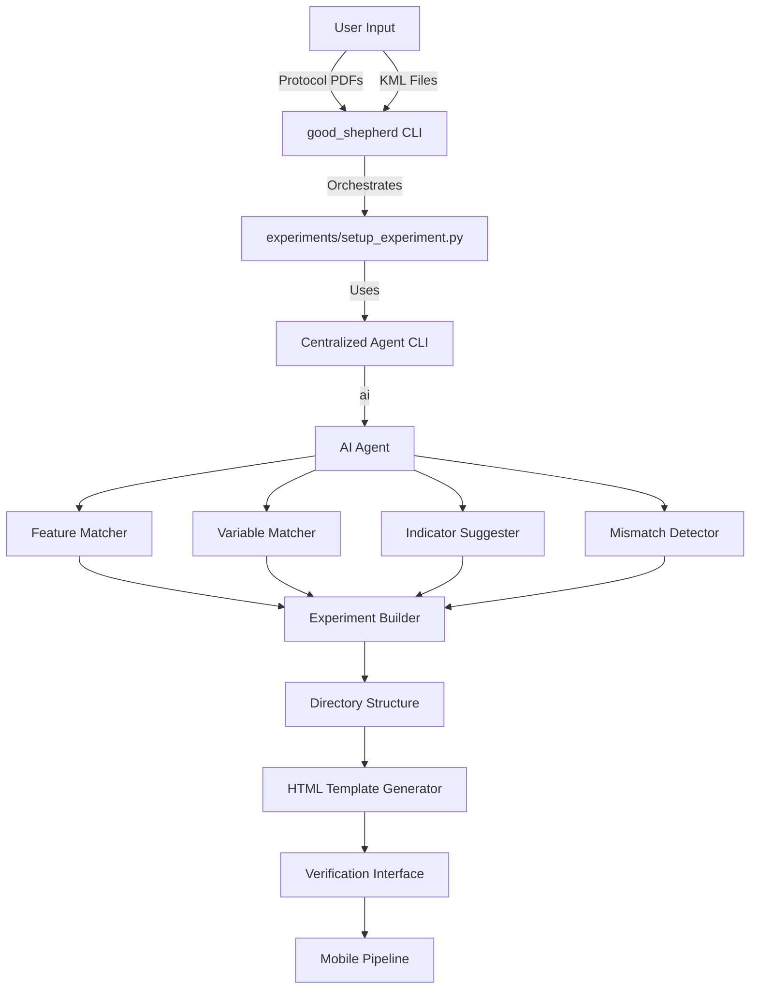

# Experiment Protocol Setup System - Phase 1

## Overview

This system automates the setup of ecological experiments by analyzing protocol documents and KML maps, matching features, identifying required variables, requesting datasheet images, and suggesting indicators. The output is a structured directory that feeds into a mobile field data collection pipeline.

## Architecture



## Directory Structure

```
good-shepherd/                      # Root directory
├── good_shepherd                   # Main orchestration script (executable)
├── experiments/                    # Experiments directory
│   ├── _index.json                # Master index of all experiments
│   ├── prompts/                   # Centralized prompts (shared across experiments)
│   │   ├── feature_matching.md
│   │   ├── variable_matching.md
│   │   ├── indicator_suggestion.md
│   │   ├── mismatch_detection.md
│   │   └── json_only_system.md    # System prompt for JSON-only output
│   ├── schemas/                   # Centralized data schemas (shared)
│   │   ├── experiment_schema.json
│   │   ├── feature_schema.json
│   │   ├── variable_schema.json
│   │   └── indicator_schema.json
│   ├── tools/                     # Centralized scripts/tools
│   │   ├── setup_experiment.py   # Main setup script
│   │   ├── agent_invoker.py      # Centralized agent CLI wrapper
│   │   ├── kml_parser.py          # KML parsing utilities
│   │   ├── protocol_parser.py     # Protocol PDF parsing
│   │   ├── html_generator.py     # HTML template generator
│   │   └── status_manager.py      # Status tracking utilities
│   └── {experiment_id}/           # e.g., "bkm_cestrum_2024"
│       ├── experiment.json        # Experiment metadata with status tracking
│       ├── protocol/              # Protocol documents (copied)
│       │   ├── field_protocol_bkm.pdf
│       │   └── ...other_protocols.pdf
│       ├── maps/                  # Map files (copied)
│       │   ├── sites.kml
│       │   ├── sites.geojson      # Converted from KML
│       │   └── ...other_maps.kml
│       ├── features/              # Feature definitions
│       │   ├── features.json      # All features with metadata
│       │   └── feature_hierarchy.json
│       ├── variables/             # Variable definitions
│       │   ├── variables.json     # All variables by feature type
│       │   └── datasheets/        # Datasheet images (user manually places here in Phase 1)
│       │       ├── plot_dbh_template.jpg
│       │       └── ...
│       ├── indicators/            # Indicator definitions
│       │   └── indicators.json    # All indicators by feature type (English descriptions)
│       ├── analysis/               # Analysis outputs
│       │   ├── protocol_analysis.md
│       │   └── mismatches.json
│       ├── verification.html      # Interactive verification interface
│       └── README.md
└── docs/
    └── design/
        └── phase1_setup_experiment.md  # This plan document
```

## Command Sequence

### Main Orchestration Command (Root Level)

```bash
./good_shepherd setup-experiment \
  --name "bkm_cestrum_2024" \
  --protocol "experiments/keystone/bkm/field_protocol_bkm.pdf" \
  --maps "experiments/keystone/bkm/sites/assets/sites.kml" \
  [--stage {initialize|features|variables|indicators|mismatches|html}]
```

**What it does:**

- Invokes `experiments/tools/setup_experiment.py` with proper paths
- Passes through all arguments
- Understands root-relative paths

### Direct Script Invocation (For Testing)

```bash
cd experiments
python tools/setup_experiment.py \
  --name "bkm_cestrum_2024" \
  --protocol "../keystone/bkm/field_protocol_bkm.pdf" \
  --maps "../keystone/bkm/sites/assets/sites.kml" \
  --stage features
```

### Stage-Based Testing

Each stage can be tested independently:

```bash
# Stage 1: Initialize directory structure
./good_shepherd setup-experiment --name "test" --protocol "path/to/protocol.pdf" --maps "path/to/maps.kml" --stage initialize

# Verify: Check that experiment directory exists, JSON files initialized
# Expected: experiments/test/experiment.json with status.stage = "initialized"

# Stage 2: Feature matching
./good_shepherd setup-experiment --name "test" --protocol "path/to/protocol.pdf" --maps "path/to/maps.kml" --stage features

# Verify: Check features/features.json
# Expected: Features matched, status.features = "complete"
# Cross-check: Compare with manual understanding of protocol and KML

# Stage 3: Variable matching
./good_shepherd setup-experiment --name "test" --protocol "path/to/protocol.pdf" --maps "path/to/maps.kml" --stage variables

# Verify: Check variables/variables.json
# Expected: Variables extracted for each feature type
# Cross-check: Compare with protocol text

# Stage 4: Indicator suggestion
./good_shepherd setup-experiment --name "test" --protocol "path/to/protocol.pdf" --maps "path/to/maps.kml" --stage indicators

# Verify: Check indicators/indicators.json
# Expected: Indicators with English descriptions

# Stage 5: Mismatch detection
./good_shepherd setup-experiment --name "test" --protocol "path/to/protocol.pdf" --maps "path/to/maps.kml" --stage mismatches

# Verify: Check analysis/mismatches.json
# Expected: Mismatches identified and categorized

# Stage 6: HTML generation
./good_shepherd setup-experiment --name "test" --protocol "path/to/protocol.pdf" --maps "path/to/maps.kml" --stage html

# Verify: Check verification.html
# Expected: Interactive HTML with maps, variables, indicators, mismatches
```

**Testing Methodology:**

1. Run CLI with `--stage` flag
2. Examine output JSON files
3. Cross-check against independent understanding of protocol and KML
4. Verify status in `experiment.json` updated correctly
5. If stage fails, fix and re-run (previous stages skipped automatically)

## Centralized Agent Invocation

### Agent CLI Wrapper (`experiments/tools/agent_invoker.py`)

This module centralizes all Gemini CLI invocations. The actual command used is:

```bash
gemini -p "$(cat prompt.md)" @protocol.pdf @sites.kml
```

The agent invoker:
- Reads prompt files from `experiments/prompts/`
- Passes files directly to gemini using `@file` syntax (multimodal)
- Supports system prompt via `GEMINI_SYSTEM_MD` environment variable
- Extracts JSON from agent output (handles markdown code blocks, extra text)
- Can be modified once to affect all agent calls

### Usage in Setup Script

```python
# In setup_experiment.py
from tools.agent_invoker import invoke_agent

# Feature matching
features_json = invoke_agent(
    prompt_file="feature_matching.md",
    input_files=[
        str(experiment_dir / "protocol" / "field_protocol_bkm.pdf"),
        str(experiment_dir / "maps" / "sites.kml")
    ],
    output_file=str(experiment_dir / "features" / "features.json")
)
```

## Centralized Prompts

### Prompt File Structure (`experiments/prompts/`)

All prompts are stored in `experiments/prompts/` and can reference schemas via placeholders like `{feature_schema}` which are injected at runtime.

**`feature_matching.md`:** Matches KML features to protocol features
**`variable_matching.md`:** Extracts variables from protocol for each feature type
**`indicator_suggestion.md`:** Suggests indicators with English descriptions
**`mismatch_detection.md`:** Identifies mismatches between protocol and KML
**`json_only_system.md`:** System prompt for JSON-only output mode

## Centralized Schemas

### Schema Files (`experiments/schemas/`)

All JSON schemas are stored in `experiments/schemas/`:
- `experiment_schema.json` - Experiment metadata structure
- `feature_schema.json` - Feature matching output structure
- `variable_schema.json` - Variable extraction output structure
- `indicator_schema.json` - Indicator suggestion output structure
- `mismatch_schema.json` - Mismatch detection output structure

Schemas are used for:
1. Validation of agent outputs
2. Injection into prompts (as JSON examples)
3. Documentation of expected data structures

## Path Configuration

### Configuration in Scripts

All scripts in `experiments/tools/` use `experiments/tools/config.py` which:
- Defines `EXPERIMENTS_DIR` as parent of `tools/`
- Provides helper functions for getting absolute paths
- No relative path dependencies

## Root Orchestration Script

### `good_shepherd` (Root Level)

The root script (`good_shepherd`) orchestrates all experiment-related commands:
- Routes to appropriate tools in `experiments/tools/`
- Handles path resolution (root-relative paths)
- Can invoke scripts from other directories in future phases

## Implementation Details

### Stage Execution Flow

1. **Check Status**: Each stage checks if it's already complete
2. **Run Stage**: Execute stage logic
3. **Update Status**: Mark stage as complete/failed
4. **Save Outputs**: Write JSON files to experiment directory

### Status Tracking

Status is stored in `experiment.json`:
- `status.stage`: Current main stage
- `status.{stage}`: Individual stage status (pending/in_progress/complete/failed)
- `status_history`: Timeline of stage completions

### Error Handling

- If agent call fails, status marked as "failed" with error message
- Script can be re-run and will skip completed stages
- Failed stages can be re-run by specifying `--stage` flag

## Testing Strategy

### Incremental Testing Per Stage

Each stage should be tested independently:

1. Run with `--stage` flag
2. Examine output JSON files
3. Cross-check against protocol and KML understanding
4. Verify status updated correctly
5. Fix issues and re-test

### Verification Checklist

**Initialize:**
- [ ] Directory structure created
- [ ] Files copied correctly
- [ ] JSON files initialized
- [ ] Status set to "initialized"

**Features:**
- [ ] Features matched correctly
- [ ] Feature hierarchy identified
- [ ] Unmatched features noted
- [ ] Status updated

**Variables:**
- [ ] Variables extracted for each feature type
- [ ] Column structures identified
- [ ] Protocol references included
- [ ] Status updated

**Indicators:**
- [ ] Indicators suggested appropriately
- [ ] English descriptions provided
- [ ] Source variables linked
- [ ] Status updated

**Mismatches:**
- [ ] Missing features identified
- [ ] Count mismatches detected
- [ ] Severity levels appropriate
- [ ] Recommendations provided
- [ ] Status updated

**HTML:**
- [ ] HTML file generated
- [ ] Maps display correctly
- [ ] Features shown by type
- [ ] Variables and indicators listed
- [ ] Mismatches displayed
- [ ] File input addition works
- [ ] Status updated

## Data Schemas

See `experiments/schemas/` for complete JSON schemas. Key structures:

- **experiment.json**: Metadata with status tracking
- **features.json**: Feature definitions with geometry
- **variables.json**: Variable definitions with column schemas
- **indicators.json**: Indicator definitions with English descriptions
- **mismatches.json**: Mismatch reports with recommendations

## Consuming Assets for Subsequent Phases

### For Phase 2 (Datasheet Processing)

**Inputs:**
- `experiments/{experiment_id}/variables/variables.json` - Variable definitions
- `experiments/{experiment_id}/variables/datasheets/*.jpg` - Datasheet images (manually placed)

**Outputs:**
- Updated `variables/variables.json` with column names extracted from datasheets
- Status updated: `status.variables_parsed = "complete"`

**Script:**
```bash
./good_shepherd process-datasheets --experiment "bkm_cestrum_2024" --datasheets "path/to/datasheet1.jpg" "path/to/datasheet2.jpg"
```

### For Phase 3 (Indicator Formula Generation)

**Inputs:**
- `experiments/{experiment_id}/indicators/indicators.json` - Indicators with English descriptions
- `experiments/{experiment_id}/variables/variables.json` - Variables with column schemas

**Outputs:**
- Updated `indicators/indicators.json` with `calculation` formulas
- Status updated: `status.indicators_formulas = "complete"`

### For Mobile Pipeline

**Inputs:**
- `experiments/{experiment_id}/experiment.json` - Experiment metadata
- `experiments/{experiment_id}/features/features.json` - Feature definitions with coordinates
- `experiments/{experiment_id}/variables/variables.json` - Variable definitions with datasheet links
- `experiments/{experiment_id}/indicators/indicators.json` - Indicator definitions

**Usage:**

Mobile app reads these JSON files to:
1. Show field worker their assigned features on map
2. Display appropriate datasheet when worker navigates to feature
3. Collect data according to variable schemas
4. Compute indicators using formulas

## Dependencies

- `gemini` CLI - For AI agent interactions (`gemini -p "prompt" @file1 @file2`)
- `pdfplumber` - For PDF text extraction
- `xml.etree.ElementTree` - For KML parsing
- `folium` - For map visualization
- `json` - For data serialization
- `jsonschema` - For schema validation

## File Locations

- Root orchestration: `good_shepherd` (executable)
- Main setup script: `experiments/tools/setup_experiment.py`
- Agent invoker: `experiments/tools/agent_invoker.py`
- Status manager: `experiments/tools/status_manager.py`
- HTML generator: `experiments/tools/html_generator.py`
- KML parser: `experiments/tools/kml_parser.py`
- Protocol parser: `experiments/tools/protocol_parser.py`
- Configuration: `experiments/tools/config.py`
- Prompts: `experiments/prompts/*.md`
- Schemas: `experiments/schemas/*.json`
- Plan document: `docs/design/phase1_setup_experiment.md`

