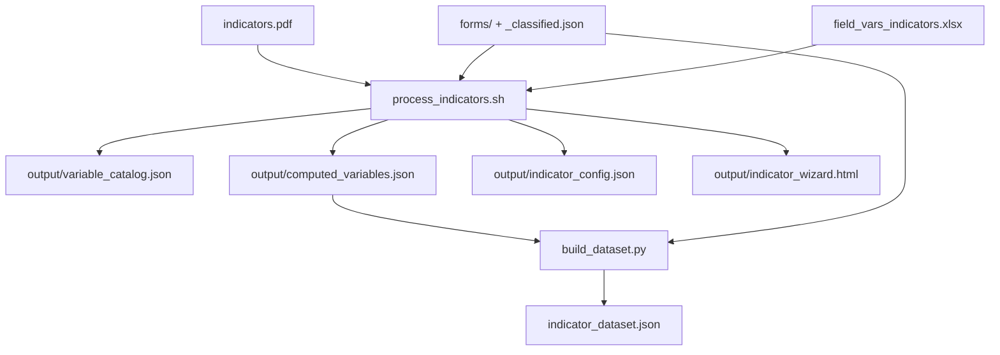

# Indicator Wizard

This stage captures how raw form variables are transformed into computed variables and indicators.
It produces a reusable "codex" that can be applied whenever new form data arrives.

## Quick Start (POC)

### 1) Run the onboarding pipeline
```bash
./process_indicators.sh <path_to_indicators_pdf> <path_to_forms_dir> [optional_xlsx]
```

**Example:**
```bash
./process_indicators.sh ../inputs/indicators.pdf ../inputs/forms ../inputs/field_vars_indicators.xlsx
```

**Outputs (written to `output/`):**
- `indicator_config.json`
- `computed_variables.json`
- `variable_catalog.json`
- `indicator_wizard.html`

### 1b) Start the compute server (optional)
This enables the \"Generate formula\" button in the wizard UI.
```bash
source .venv/bin/activate && python3 examples/indicators/scripts/compute_server.py
```

### 2) Recompute the dataset
```bash
python3 scripts/build_dataset.py \
  --codex-dir ./output \
  --forms-dir ../inputs/forms \
  --out indicator_dataset.json
```

## Directory Structure
- `docs/`: design notes and planning
- `scripts/`: pipeline scripts (agent + builders)
- `standards/`: minimal schema stubs

## Inputs
- `indicators.pdf`: indicator definitions
- `forms/`: images + `_classified.json` (Textract outputs)
- `field_vars_indicators.xlsx` (optional): variable definitions + lookups

## Outputs
- `indicator_config.json`: indicator definitions + graph intents
- `computed_variables.json`: English intent + compiled code (JSONLogic/JS)
- `variable_catalog.json`: raw variable catalog from forms
- `indicator_wizard.html`: standalone UI for user edits
- `indicator_dataset.json`: raw + computed data for visualization

## Summary Data Flow


## Notes
- JSONLogic is preferred for compiled expressions; JS fallback is allowed.
- Evidence snippets are optional but recommended for traceability.
- Computed variables are evaluated per record in a single long table; missing inputs should yield null/empty.
- Records from different form types will have different subsets of fields populated; others remain empty.

```
  ./examples/indicators/process_indicators.sh examples/inputs/indicators.pdf examples/inputs/
  forms examples/inputs/field_vars_indicators.xlsx

  It will write outputs to examples/indicators/output/.
```
