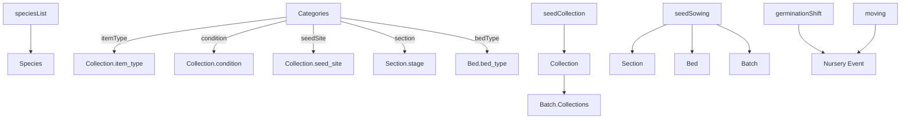

# Nursery ETL Mapping (NCF -> Frappe)

This file documents how `nursery_tracker.xlsx` maps into the Nursery DocTypes and how to validate the ETL.

## Source File
- `examples/nursery/inputs/data/nursery_tracker.xlsx`
- Sheets: `seedCollection`, `seedSowing`, `germinationShift`, `moving`, `initialStock`, `speciesList`, `categories`

---

## Ingestion Flow (NCF data types -> DocType)

```
SpeciesList -> Species
Categories -> Bed Type / Item Type / Condition / Seed Site
seedCollection -> Collection
seedSowing -> Section -> Bed -> Batch -> Batch Collections
(germinationShift/moving) -> Nursery Event (transplant/move/germination)
```

Key notes:
- `Batch` requires `Species`, `Section`, and `Bed` to exist.
- `Batch Collections` is a child table on `Batch` and requires `Collection` records.
- `germinationShift` and `moving` events require a `Batch` (or a reliable batch key).

---

## 1) Category Mappings (from `categories` sheet)

| Excel Field | DocType.Field | Notes |
|---|---|---|
| itemType | Collection.item_type | Reference list |
| condition | Collection.condition | Reference list |
| seedSite | Collection.seed_site | Reference list |
| section | Section.section_name | Use raw section labels (A-E) |
| bedType | Bed.bed_type | Reference list |

---

## 2) DocType DAG (Mermaid)



---

## 3) Workflow Rules vs Events (Philosophy)

The nursery has conceptual stages (germination -> growing -> exit).  
The input sheets do not always state a stage explicitly, so a rule engine (ETL logic)
interprets the rows and emits events that declare the batch’s status.

Principles:
- Events are the source of truth; workflow rules live outside Frappe.
- Rules can vary by dataset (e.g., germination time for a species).
- This gives flexibility: if a nursery uses a 20-day germination window, the ETL can
  encode that rule and emit events accordingly without changing platform logic.

---

## 4) Stage Mapping Rules (Dataset Strategy)

We do not map section/bed names directly to stages. Instead:
- Create Sections for the raw labels in the dataset (A-E).
- Beds belong to these Sections.
- Stage is inferred only from the latest event for a batch.

Rules used for this dataset:
- Stage codes A-E are physical sections only (no stage meaning).
- Sowing: each seedSowing row -> Batch (date_sown).
- Germination baseline: create a germination event with quantity=0 on date_sown.
- germinationShift row:
  - Create a germination event for seedlingsShifted at shift date.
  - Create a transplant event for seedlingsShifted at shift date (to growing).
  - If goodSeeds > seedlingsShifted, create a failure event for the remaining count.
- No germinationShift row:
  - Assume the batch is still germinating (no transplant).
- moving sheet:
  - Create move events (best-effort batch matching).
- initialStock:
  - Ignored for now (per POC); can be used later to seed growing stage.

---

## 5) Unmapped Fields -> source_payload_json

If a sheet has fields that do not map to a DocType, store them as JSON in the
DocType `source_payload_json` field, for example:
`{"deliveryDate": "2024-01-10", "sourceRemarks": "from fallen tree"}`.

---

## 6) Field Mapping 

### A) speciesList -> Species
| Excel Field | DocType.Field | Notes |
|---|---|---|
| acceptedName | Species.accepted_name | Labelled as Scientific Name in UI |
| ERAspeciesURL | Species.era_species_url | URL reference |
| nameSource | Species.name_source | Enumerated (POWO, ERA-India, local taxonomy list) |
| IUCNstatus | Species.iucn_status | Optional |

### B) categories -> Category Reference Data
| Excel Field | DocType.Field | Notes |
|---|---|---|
| itemType | Collection.item_type | Used in Collection |
| condition | Collection.condition | Used in Collection |
| seedSite | Collection.seed_site | Used in Collection |
| section | Section.stage | Used for Section stage labels |
| bedType | Bed.bed_type | Used in Bed |

### C) seedCollection -> Collection

We will create a Collection per entry in seedCollection

| Excel Field | DocType.Field | Notes |
|---|---|---|
| collectionID | Collection.name | Use as name if unique |
| dateCollected | Collection.date_collected | Date |
| species | Collection.species | Link to Species |
| itemType | Collection.item_type | From categories |
| condition | Collection.condition | From categories |
| seedSite | Collection.seed_site | From categories |
| gpsLatitude | Collection.gps_latitude | EPSG:4326 |
| gpsLongitude | Collection.gps_longitude | EPSG:4326 |
| gpsElevation | Collection.gps_elevation | Optional |
| locality | Collection.locality | Optional |
| collectedBy | Collection.collected_by | Text |
| remarks | Collection.remarks | Optional |
| deliveryDate | Collection.source_payload_json | Unmapped; store as JSON |

### D) seedSowing -> Section + Bed + Batch + Batch Collections

We will create a batch per entry in seedSowing
We will create a Bed per mentioned bedNo, with the mentioned bedType 
The batchID will be per our namescheme (date-speciescode), the original batchID will be saved in a `legacy_batch_id` field

| Excel Field | DocType.Field | Notes |
|---|---|---|
| batchID | Batch.name | Can be used directly (or preserve in a separate field) |
| species | Batch.species | Link to Species |
| goodSeeds | Batch.total_seeds | Total seeds in batch |
| fruitsByWt | Batch.source_payload_json | Unmapped; store as JSON |
| seedlings | Batch.source_payload_json | Unmapped; store as JSON |
| dateSown | Batch.date_sown | Date |
| plantedBy | Batch.planted_by | Text |
| section | Section.section_name + Section.stage | Create if missing |
| bedNo | Bed.bed_name | Create if missing |
| bedType | Bed.bed_type | From categories |
| remarks | Batch.remarks | Free text |

Batch Collections (from seedCollection):
- This spreadsheet does not specify which collection(s) feed each batch.
- For the POC, you can:
  - Add a single allocation per batch, or
  - Infer from `collectionID` if a mapping is provided later.

### E) germinationShift -> Nursery Event (type: Germination/Transplant)

A new germination event and a new transplant event will be created for each row in germinationShift
No incremental recording of germinations is possible on the input data 

| Excel Field | DocType.Field | Notes |
|---|---|---|
| batchID | Nursery Event.batch | Link to Batch |
| date | Nursery Event.event_date | Date |
| species | Nursery Event.notes | Optional (redundant if batch exists) |
| action | Nursery Event.event_type | Map to `germination` or `transplant` |
| seedlingsShifted | Nursery Event.quantity | Absolute count |
| fromSection | Nursery Event.from_section | Optional |
| fromBedNo | Nursery Event.from_bed | Optional |
| toSection | Nursery Event.to_section | Optional |
| toBedNo | Nursery Event.to_bed | Optional |
| bedType | Bed.bed_type | Used only if new beds are created |

### F) moving -> Nursery Event (type: Move)

For every move, a new Move event will be created where the seedlingsShifted field turns in the Quantity field 
Since there is no batchID one will be assumed via a best-effort mapping is needed (e.g., by species + section + date).

| Excel Field | DocType.Field | Notes |
|---|---|---|
| date | Nursery Event.event_date | Date |
| species | Used to locate Batch | Sheet lacks batchID |
| moveType | Nursery Event.event_type | Map to `move` |
| seedlingsShifted | Nursery Event.quantity | Absolute count |
| fromSection | Nursery Event.from_section | Optional |
| fromBedNo | Nursery Event.from_bed | Optional |
| toSection | Nursery Event.to_section | Optional |
| toBedNo | Nursery Event.to_bed | Optional |
| bedType | Bed.bed_type | Used only if new beds are created |


### G) initialStock -> Ready for sale

The initialStock rows will be mapped to seeds in Growing, i.e. saplings ready for sale. 
For each row a growth event will be recorded with a dummy 0cm height.

| Excel Field | Use | Notes |
|---|---|---|
| section | Stage summary | Compare with Stock by Stage |
| bedNo | Location | Optional |
| species | Grouping | Optional |
| number | Quantity | Used for validation |

---

## 3) Validation Checklist (Post-ETL)

- **Species count** equals `speciesList` rows.
- **Collection count** equals `seedCollection` rows.
- **Batch count** equals `seedSowing` rows.
- **Germination Summary** (per batch) matches `verify_metrics.py` output.
- **Germination by Species** (spread + avg days) matches `verify_metrics.py` output.
	Germination spread computed as time between when it was sown/batch was created -> transplant event/transition into growing stage
- **Stock by Stage** roughly matches `initialStock` sheet (if comparable).
	Stock by stage computed as count of individuals where last event was for stage X=germination,growth,exit or none (which means sown)


---

## 4) Diagram: Minimal Ingestion Flow

```
seedCollection  -> Collection
                        \
seedSowing -> Section -> Bed -> Batch -> Batch Collections
                          \
                germinationShift/moving -> Nursery Event
```

---

## 5) Fields Not Modeled (POC)

- `fruitsByWt` (seedSowing): stored in Batch.source_payload_json.
- `seedlings` (seedSowing): stored in Batch.source_payload_json.
- Any `height` values: not present in this dataset.
