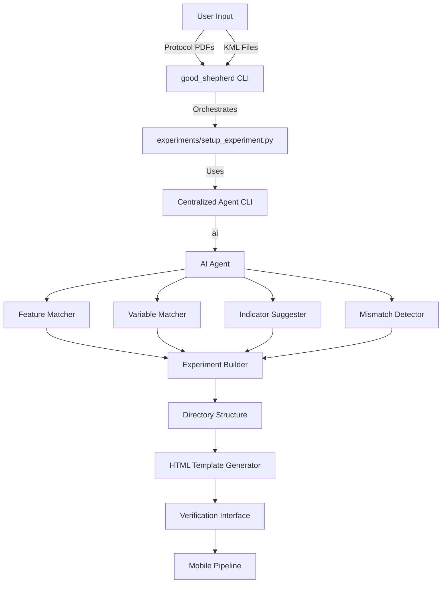

# Good Shepherd 

## Phase 1: On-boarding experiments 

How it works


How to do it

```bash
# Stage 1: Initialize directory structure
./good_shepherd setup-experiment --name "test" --protocol "path/to/protocol.pdf" --maps "path/to/maps.kml" --stage initialize

# Verify: Check that experiment directory exists, JSON files initialized
# Expected: experiments/test/experiment.json with status.stage = "initialized"

# Stage 2: Feature matching
./good_shepherd setup-experiment --name "test" --protocol "path/to/protocol.pdf" --maps "path/to/maps.kml" --stage features

# Verify: Check features/features.json
# Expected: Features matched, status.features = "complete"
# Cross-check: Compare with manual understanding of protocol and KML

# Stage 3: Variable matching
./good_shepherd setup-experiment --name "test" --protocol "path/to/protocol.pdf" --maps "path/to/maps.kml" --stage variables

# Verify: Check variables/variables.json
# Expected: Variables extracted for each feature type
# Cross-check: Compare with protocol text

# Stage 4: Indicator suggestion
./good_shepherd setup-experiment --name "test" --protocol "path/to/protocol.pdf" --maps "path/to/maps.kml" --stage indicators

# Verify: Check indicators/indicators.json
# Expected: Indicators with English descriptions

# Stage 5: Mismatch detection
./good_shepherd setup-experiment --name "test" --protocol "path/to/protocol.pdf" --maps "path/to/maps.kml" --stage mismatches

# Verify: Check analysis/mismatches.json
# Expected: Mismatches identified and categorized

# Stage 6: HTML generation
./good_shepherd setup-experiment --name "test" --protocol "path/to/protocol.pdf" --maps "path/to/maps.kml" --stage html

# Verify: Check verification.html
# Expected: Interactive HTML with maps, variables, indicators, mismatches
```

## Status

* Feature hierarchy seems useless when run as 
```
$ ./good_shepherd setup-experiment --name "test" --protocol ./experiments/keystone/bkm/field_protocol_bkm.pdf --maps ./experiments/keystone/bkm/sites/assets/sites.kml --stage features -f 
```
