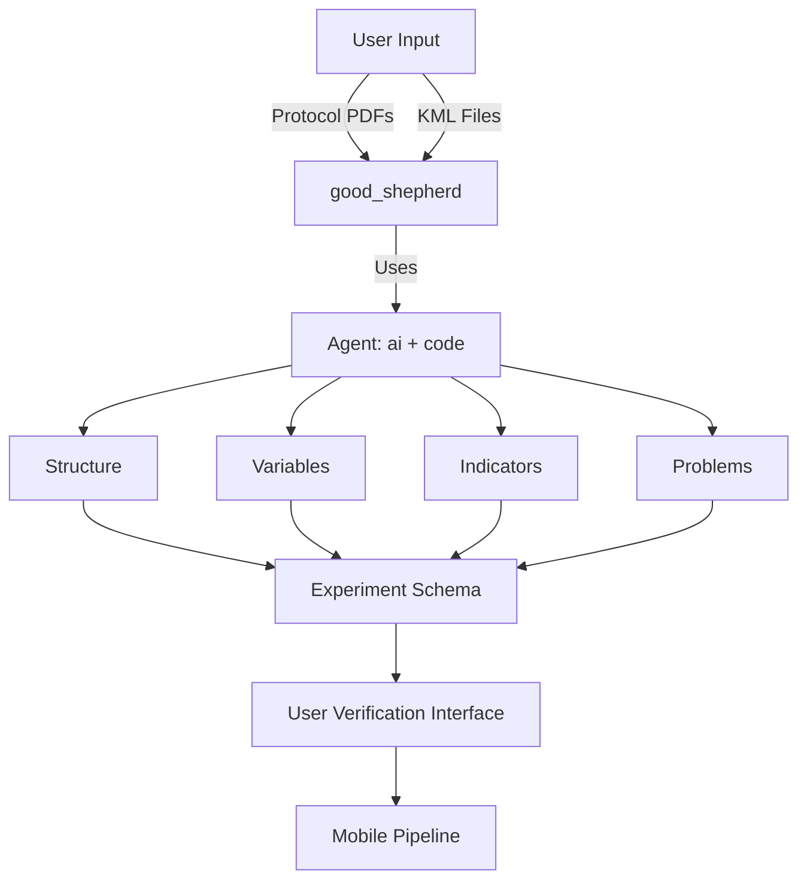

# Setup Wizard Generator

This tool automates the creation of an interactive Setup Wizard (`wizard.html`) for ecological experiments. It processes an experiment's KML map data and Protocol PDF to extract a structured hierarchy (Blocks -> Transects -> Plots) and generates a visualization.



## Quick Start

### 1. Run the Entire Pipeline
To process a new experiment from scratch (KML + PDF -> HTML):

```bash
./process_experiment.sh <path_to_kml> <path_to_protocol_pdf>
```

**Example:**
```bash
./process_experiment.sh sites.kml field_protocol.pdf
```
*   **Input:** `sites.kml` (Spatial data), `field_protocol.pdf` (Metadata & Methods).
*   **Output:** `wizard.html` (Interactive map & card UI).

### 2. Regenerate Only the Wizard HTML
If you have manually edited `experiment.json` or want to re-style the UI without re-running the AI Agent:

```bash
python3 scripts/build_wizard.py experiment.json features.geojson > wizard.html
```

---

## Directory Structure

### `/standards`
Contains the shared schemas and rules that define the data structure.
*   **`experiment_schema.json`**: The JSON Schema defining the valid structure for `experiment.json`.
*   **`kml_rules.md`**: Documentation of the geometric heuristics used to classify KML features (e.g., nesting rules for Block vs. Plot).

### `/scripts`
Contains the utility scripts for each step of the pipeline.
*   **`extract_kml_features.py`**: Parses raw KML, applies geometric logic to identify hierarchy, and outputs `kml_summary.json` and `features.geojson`.
*   **`run_agent.sh`**: Wrapper for the `gemini` CLI to invoke the AI model consistently.
*   **`build_wizard.py`**: Merges `experiment.json` and `features.geojson` to generate the standalone `wizard.html`.

---

## Pipeline Artifacts & Files

### 1. `features.geojson` (Reusable Spatial Data)
*   **Created by:** `extract_kml_features.py` (Step 1).
*   **Contains:** A flat collection of all valid spatial features (Polygons, LineStrings, Points) extracted from the KML.
*   **Usage:** This is the spatial database used by the Leaflet map in `wizard.html`. It is detached from the hierarchy logic, serving purely as the geometry source.

### 2. `constructed_prompt.md` (Intermediate)
*   **Created by:** `process_experiment.sh` (Step 2).
*   **Contains:** A dynamically assembled prompt for the AI Agent. It concatenates:
    *   System instructions (`json_spatial_system.md`).
    *   Output Schema (`standards/experiment_schema.json`).
    *   KML Summary (`kml_summary.json` - the ground truth of what features exist).
*   **Usage:** Sent to the AI model to ensure it produces JSON that strictly adheres to the schema and uses real feature names from the KML.

### 3. `experiment.json` (Core Output)
*   **Created by:** The AI Agent (Step 3).
*   **Contains:** The semantic representation of the experiment.
    *   **Metadata**: Title, Aim.
    *   **Hierarchy**: Structured tree of Blocks, Transects, and Plots with descriptions, variables, and dimensions extracted from the PDF.
    *   **Mappings**: Maps specific feature names (from KML) to their logical component (e.g., "Feature A is a Block").
*   **Validation:** Structure is defined by `standards/experiment_schema.json`.

### 4. `json_spatial_system.md` (Configuration)
*   **Contains:** The high-level system prompt for the AI Agent, defining its persona (Ecological Data Assistant) and strict output formatting rules (JSON only).

### 5. `wizard.html` (Final Artifact)
*   **Created by:** `build_wizard.py` (Step 4).
*   **Contains:** A standalone HTML file containing the map, experiment logic, and UI. It embeds the data from `experiment.json` and `features.geojson` directly, making it portable.
